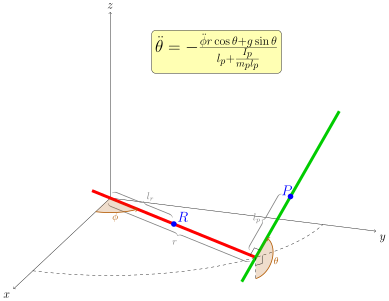

# Overview

CartPole is an educational project of [the robotics group](https://cs.hse.ru/robotics) (HSE/FCS).
It is designed to learn the basics of optimal control and reinforcement learning.
The environment is a variation of famous control problem,
where a pole is attached by a joint to a cart, moving along a axis.
Some motor drives the cart with acceleration as control input.
The goal is to swing up the pole and maintain it in unstable equilibrium state.
You can follow our progress on [YouTube](https://youtube.com/playlist?list=PLR1nN_AQOO9yAG5CHOA4l2x3j89t-3PYf).

<figure markdown>
  
  <figcaption>Linear CartPole</figcaption>
</figure>

Linear CartPole is classic kinematic scheme, but it requires a lot of space, periodical homing (return cart to the initial pose) and etc.
Radial CartPole is a modification, which allows to avoid these problems, keeping the same motion equations.
In case of radial version cart moves along the circle with radius $r$. Yoy can see the difference on the pictures below.

=== "Linear"
    

=== "Radial"
    

