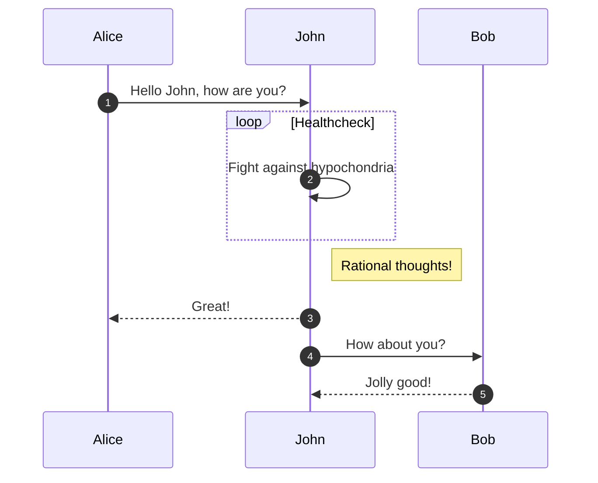

# MkDocs & mkdocs-material syntax test

See [mkdocs-material](https://squidfunk.github.io/mkdocs-material/reference/) for more examples

## Callouts

!!! note "Important note"
    This is a note

!!! warning
    Uh oh

## Buttons

[Open Foxglove](http://foxglove.robotics-lab.ru/){ .md-button target="_blank" }

## Code

``` py title="main.py"
import tensorflow as tf
```

## Math

$$
\operatorname{ker} f=\{g\in G:f(g)=e_{H}\}{\mbox{.}}
$$

## Images

<figure markdown>
  { width="600" }
  <figcaption>Image caption</figcaption>
</figure>

## Diagrams


